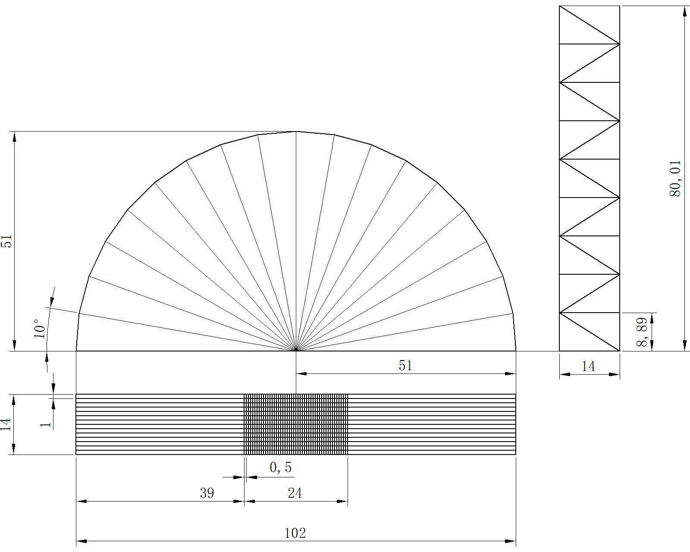
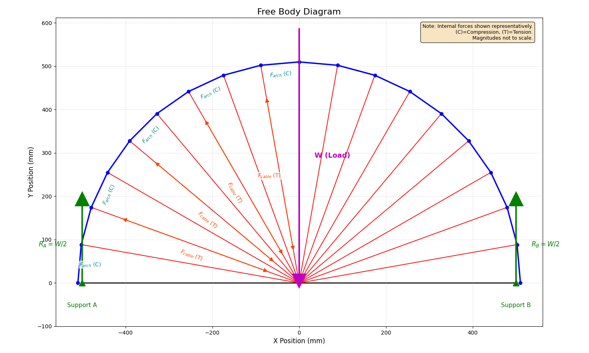

# **Spaghetti Bridge Design and Analysis**

## **1. Introduction**

This report documents the design process, structural analysis, and performance prediction for our team's semi-circular arch Spaghetti bridge. A structural analysis considering potential failure modes (arch buckling, cable tension failure, arch compression failure, glue joint shear failure) was performed. The Spaghetti Bridge project's objective is to maximize the load-carrying capacity of the bridge, though self-weight analysis is omitted here for simplicity, focusing on failure load. Based on assumed material properties and construction details, the bridge's maximum load capacity is predicted to be approximately **240.3 N (24.03 kg)**, with the anticipated failure mode being **shear failure of the glue joints** connecting the central tension cables to the deck structure.

## **2. Design Description**

### 2.1. Overall Geometry

The bridge employs a semi-circular arch design, chosen for its strength in tension and compression, which is advantageous for brittle materials like spaghetti. Key dimensions in the CAD drawings are:

- Arch Radius (Height): $R = 51\\text{cm} = 510\\text{mm}$
- Total Span (Length): $L_{total} = 102\\text{cm} = 1020\\text{mm}$
- Support Condition: The bridge rests on platforms with a 1 cm overlap at each end.
- Effective Span (Unsupported Length): $L_{eff\_ span} = 1020\\text{mm} - 2 \times 10\\text{mm} = 1000\\text{mm}$
- Structural Width (Arch Separation): $W_{bridge} = 14\\text{cm} = 140\\text{mm}$ (Distance between parallel arches/frames).
- Loading Deck Width: $W_{deck} = 24\\text{cm} = 240\\text{mm}$ (Area where load is applied).

The front view shows the semi-circular arch with radial tension members (cables) spaced every 10 degrees. The bottom view details the loading deck grid structure. The side view illustrates the truss-like structure connecting the arches/deck and the profile members.

### 2.2. Component Details

- **Arch & Main Structure:** Constructed using bundles of 5 spaghetti strands, bonded together tightly with hot melt glue on joints. These members form the primary semi-circular arch and longitudinal and cross members based on side/bottom views.
- **Tension Cables:** Constructed using bundles of 3 spaghetti strands. These radiate from the arch base/deck level up to connect to points along the arch, transferring load from the deck to the arch. There are 17 such members spanning the 180 degrees of the arch (excluding the deck).
- **Deck:** The bottom view shows a grid structure designed to distribute the applied load. It consists of longitudinal members spaced 0.5 cm and transverse members spaced 1 cm. This grid is made of the 5-strand bundles as well (thick lines).
- **Joints:** All connections between spaghetti bundles are made using standard hot melt glue. Significant attention was paid to wrapping joints with a substantial amount of glue to enhance stiffness and shear area.

### 2.3. Materials

- **Spaghetti:** La sicilia 5# spaghetti, diameter $d = 1.75\,\text{mm}$. Single strand cross-sectional area $A_{strand} = \pi(d/2)^{2} = \pi(1.75/2)^{2} \approx 2.405\,\text{mm}^{2}$.
- **Adhesive:** Deli hot melt glue.

### 2.4. Construction Method

The initial length of the spaghetti is between 25.5cm and 26cm, so we cut all of them to 25.5cm before starting. Bundles were formed by grouping 3 or 5 strands and applying hot melt glue on joints to encourage the tensile strength and compressive strength. Segments were cut to length (individual pieces are 25.5 cm, though the structure geometry dictates actual member lengths) and joined at nodes using generous amounts of hot melt glue, ensuring full coverage around the joint.

### 2.5. Design Rationale

- **Arch Shape:** A semi-circular arch primarily experiences compressive forces under a distributed or central load. Spaghetti is strong in compression, making this an efficient shape.
- **Tension Cables:** The radiating cables transfer the load from the deck upwards to the arch, primarily acting in tension. Spaghetti, while weaker in tension than compression, can handle moderate tensile loads, especially when bundled. Placing cables radially helps distribute the load transfer points along the arch.
- **Bundling:** Grouping strands into bundles increases the cross-sectional area and, more importantly, the moment of inertia ($I$) compared to individual strands. This significantly enhances resistance to buckling in compression members (the arch) and increases the load capacity of tension members. Assuming composite action (strands acting together) is key to achieving higher capacity.
- **Deck Grid:** Provides a platform for applying the load and helps distribute it to the main structural elements (cables/arch supports). The grid pattern adds stiffness to the deck plane.
- **Glue Joints:** They are potential weak points. Using ample glue aims to maximize the shear transfer area and provide some rotational stiffness at the joints.

## **3.** **Free Body Diagram**

### 3.1. Diagram

For analyzing the overall structure under the applied load $W$, we consider the entire bridge as a rigid body. The load $W$ is applied vertically downwards at the center of the effective span. The bridge is supported at both ends. Assuming simple supports (allowing rotation but preventing vertical displacement), we have vertical reaction forces $R_{A}$ and $R_{B}$ at the left and right supports, respectively.

Due to symmetry in geometry and loading: $R_{A} = R_{B} = W/2$

### 3.2. Analysis Method

The structural analysis of the spaghetti bridge involves principles from both statics and mechanics of materials, which requires more knowledge, therefore, we searched a lot of relevant materials, formulas and cases on the Internet, and used them as reference to analyze the forces of our bridge.

- **Equilibrium:** The entire bridge structure, as well as each individual member and joint, must be in static equilibrium under the applied loads and reactions. This means the sum of forces in any direction and the sum of moments about any point must be zero ($\Sigma F_{x} = 0$, $\Sigma F_{y} = 0$, $\Sigma M = 0$).
- **External Reactions:** Determined by the free body diagram as shown above ($R_{A} = R_{B} = W/2$).
- **Internal Forces:** Methods like the Method of Joints or Method of Sections can be used to determine the axial forces (tension or compression) in each member of the arch and cable system. Due to the complexity of the geometry, simplified models or assumptions about force distribution are often necessary. For this analysis, we utilize force factors ($f_{a}$ and $f_{c}$) derived from detailed analysis that relate the total applied load $W$ to the maximum force in the arch ($F_{arch}$) and the maximum force relevant to cable/central joint failure ($F_{cable/joint}$).
  - $F_{arch} = W/f_{a}$
  - $F_{cable/joint} = W/f_{c}$ (The calculation section uses these factors inversely to find W from member forces).

After internal forces are known (or related to W), we analyzed the potential failure modes:

- **Axial Stress:** Tensile or compressive stress in a member is $\sigma = P/A$, where P is the axial force and A is the cross-sectional area. Failure occurs if $\sigma$ exceeds the material's tensile strength ($\sigma_{ut}$) or compressive strength ($\sigma_{uc}$).
- **Buckling (Compression Members):** Slender compression members (like arch segments) can fail by buckling before reaching the material's compressive strength. The critical buckling load ($P_{cr}$) is estimated using Euler's formula for columns: $P_{cr} = \frac{\pi^{2}EI}{(kL)^{2}}$, where E is Young's Modulus, I is the area moment of inertia, L is the member length, and k is the effective length factor depending on end conditions (k=1 for pinned ends, k=0.5 for fixed ends, k=0.7 for partially fixed).
- **Shear Stress (Glue Joints):** Glue joints transfer force primarily through shear. The average shear stress is $\tau = V/A_{glue}$, where V is the shear force transferred across the joint and $A_{glue}$ is the effective shear area of the glue. Failure occurs if $\tau$ exceeds the glue's shear strength ($\tau_{glue}$).

### 3.3. Assumptions

The following assumptions were made in this analysis:

- The structure is analyzed as a 2D truss/arch system for primary load paths.
- Supports are ideal simple supports (pinned/roller).
- The load $W$ is applied statically at the center of the deck span.
- Spaghetti material is homogeneous, isotropic, and linearly elastic up to failure.
- Strands within a bundle act as a composite section (perfect bonding).
- Joints are effectively rigid in transferring axial forces but may have some rotational restraint affecting buckling (k=0.7 assumed for arch segments).
- Glue properties ($\tau_{glue}$, effective area $A_{glue}$) are uniform and represent the limiting strength of the joint.
- Self-weight of the bridge is negligible compared to the applied load.
- Force factors $f_{a} = 2.0$ and $f_{c} = 5.34$ (relating total load W to peak arch force and peak cable/joint force respectively) are applicable here.

## **4. Failure Prediction**

Based on engineering intuition and the principles of structural behavior for this type of bridge:

- **High Stress Locations:**
  - **Arch Crown (Top Center):** Experiences the highest compressive stress and is most susceptible to buckling due to its position and potential for lower effective stiffness if joints are imperfect.
  - **Arch Supports (Base):** Experiences high compressive forces transferred from the arch, and potentially shear forces. Crushing of the spaghetti or failure at the support interface could occur.
  - **Central Tension Cables:** Cables nearest the center span experience the highest tensile forces as they are most directly supporting the central load.
  - **Deck-Cable-Arch Joints:** These joints, particularly near the center where forces are highest, must transfer significant tension (from cables) and shear forces. Glue failure is a common issue in spaghetti bridges.
- **Likely Failure Mode & Location:** While arch buckling is a strong possibility for arch bridges, the effectiveness of bundling (increasing $I$) might make the arch relatively robust against buckling compared to the strength of the joints or tension members. Given that spaghetti is weaker in tension than compression and glue joints are often the weakest link:
  1.  **Glue Joint Failure:** Shear failure or tensile pull-out at the joints connecting the central tension cables to the deck or arch seems highly probable, especially if the effective glue area is limited or glue strength is low.
  2.  **Tension Cable Failure:** Snapping of the central 3-strand tension cables is another likely mode if the tensile strength of the spaghetti bundles is exceeded before other limits.
  3.  **Arch Buckling:** Buckling instability, likely initiating near the crown of the arch, remains a possibility, particularly if construction imperfections exist or if joint stiffness is lower than assumed.

<!-- -->

- **Prediction:** The most likely failure initiation point is predicted to be **glue shear failure at the central joints** connecting the deck grid to the tension cables, due to the high concentration of shear force transfer required at this location and the typically lower strength of hot melt glue compared to the spaghetti itself.

## **5. Load Capacity Calculation**

We evaluate the load capacity ($W$) based on the four primary failure modes identified, using the assumed material properties and geometric parameters where necessary for numerical evaluation, but presenting symbolic formulas first. We use the force factors $f_{a} = 2.0$ (relating $W$ to max arch force) and $f_{c} = 5.34$ (relating $W$ to max cable/joint force). The maximum load $W_{\max}$ the bridge can sustain is the minimum of the loads calculated for each mode.

**Material Properties (Symbols & Assumed Values):**

- Young's Modulus: $E = 5000\text{ N/mm}^{2}$
- Tensile Strength: $\sigma_{ut} = 30\text{ N/mm}^{2}$
- Compressive Strength: $\sigma_{uc} = 50\text{ N/mm}^{2}$
- Glue Shear Strength: $\tau_{glue} = 1.5\text{ N/mm}^{2}$

**Geometric Properties:**

- Arch Bundle Area: $A_{arch} = 5 \times \pi(1.75/2)^{2} \approx 12.025\text{ mm}^{2}$
- Cable Bundle Area: $A_{cable} = 3 \times \pi(1.75/2)^{2} \approx 7.215\text{ mm}^{2}$
- Arch Segment Length (approx 10° arc): $L \approx 89.0\text{ mm}$
- Arch Bundle Moment of Inertia (composite): $I_{arch} \approx 11.4\text{ mm}^{4}$
- Effective Length Factor for Arch Buckling: $k = 0.7$
- Effective Arch Buckling Length: $L_{eff,arch} = k \times L = 0.7 \times 89.0\text{ mm} \approx 62.3\text{ mm}$
- Effective Glue Shear Area: $A_{glue} = 30\text{ mm}^{2}$

**Failure Mode Calculations:**

- **Mode 1: Arch Buckling**
  - The critical buckling force for an arch segment is $P_{cr} = \frac{\pi^{2}EI_{arch}}{(L_{eff,arch})^{2}}$.
  - The maximum compressive force in the arch is $F_{arch} = W_{buckle}/f_{a}$.
  - Setting $F_{arch} = P_{cr}$: $W_{buckle}/f_{a} = \frac{\pi^{2}EI_{arch}}{(L_{eff,arch})^{2}}$
  - Symbolic: $W_{buckle} = f_{a} \times \frac{\pi^{2}EI_{arch}}{(L_{eff,arch})^{2}}$
  - Numerical: $W_{buckle} = 2.0 \times \frac{\pi^{2} \times (5000\text{ N/mm}^{2}) \times (11.4\text{ mm}^{4})}{(62.3\text{ mm})^{2}}$ $W_{buckle} \approx 2.0 \times \frac{562330}{3881.3}\text{ N} \approx 2.0 \times 144.88\text{ N} \approx \mathbf{289.8N}$ (Check: Critical stress $\sigma_{cr} = P_{cr}/A_{arch} = 144.88/12.025 \approx 12.05\text{ MPa}$. Since $\sigma_{cr} < \sigma_{uc} = 50\text{ MPa}$, buckling occurs before crushing).
- **Mode 2: Cable Tensile Failure**
  - The maximum tensile force capacity of a cable bundle is $F_{cable,\max} = \sigma_{ut} \times A_{cable}$.
  - The maximum force related to the cable is $F_{cable/joint} = W_{cable}/f_{c}$.
  - Setting $F_{cable/joint} = F_{cable,\max}$: $W_{cable}/f_{c} = \sigma_{ut}A_{cable}$
  - Symbolic: $W_{cable} = f_{c} \times \sigma_{ut} \times A_{cable}$
  - Numerical: $W_{cable} = 5.34 \times (30\text{ N/mm}^{2}) \times (7.215\text{ mm}^{2})$ $W_{cable} = 5.34 \times 216.45\text{ N} \approx \mathbf{1155.8N}$
- **Mode 3: Arch Compressive Failure (Crushing)**
  - The maximum compressive force capacity of an arch bundle is $F_{arch,crush} = \sigma_{uc} \times A_{arch}$.
  - The maximum compressive force in the arch is $F_{arch} = W_{arch,crush}/f_{a}$.
  - Setting $F_{arch} = F_{arch,crush}$: $W_{arch,crush}/f_{a} = \sigma_{uc}A_{arch}$
  - Symbolic: $W_{arch,crush} = f_{a} \times \sigma_{uc} \times A_{arch}$
  - Numerical: $W_{arch,crush} = 2.0 \times (50\text{ N/mm}^{2}) \times (12.025\text{ mm}^{2})$ $W_{arch,crush} = 2.0 \times 601.25\text{ N} = \mathbf{1202.5N}$ (As noted in Mode 1, buckling is predicted to occur before crushing for the arch members).
- **Mode 4: Glue Shear Failure (Central Joint)**
  - The maximum shear force capacity of the central glue joint is $F_{glue,shear\_ limit} = \tau_{glue} \times A_{glue}$.
  - The maximum force related to the central joint (driving shear) is $F_{cable/joint} = W_{glue}/f_{c}$.
  - Setting $F_{cable/joint} = F_{glue,shear\_ limit}$: $W_{glue}/f_{c} = \tau_{glue}A_{glue}$
  - Symbolic: $W_{glue} = f_{c} \times \tau_{glue} \times A_{glue}$
  - Numerical (Using revised $A_{glue} = 30\text{ mm}^{2}$): $W_{glue} = 5.34 \times (1.5\text{ N/mm}^{2}) \times (30\text{ mm}^{2})$ $W_{glue} = 5.34 \times 45\text{ N} = \mathbf{240.3N}$

**Predicted Maximum Load (**$W_{\max}$**):**

The bridge is predicted to fail at the lowest load calculated among all modes: $W_{\max} = min(W_{buckle},W_{cable},W_{arch,crush},W_{glue})$ $W_{\max} = min(289.8\text{ N},1155.8\text{ N},1202.5\text{ N},240.3\text{ N})$ $W_{\max} = \mathbf{240.3N}$

Converting to kilograms (using $g \approx 9.81\text{ m/s}^{2}$): $W_{\max}(\text{kg}) = 240.3\text{ N}/9.81\text{ m/s}^{2} \approx \mathbf{24.5}\text{ kg}$

**Predicted Failure Mode:** The analysis indicates that **Glue Shear Failure** (Mode 4) is the critical failure mode, occurring at the lowest predicted load.

## **6. Discussion**

- **Comparison of Modes:** The glue joints ($W_{glue} = 240.3\text{ N}$) are predicted to fail well before arch buckling ($W_{buckle} = 289.8\text{ N}$). Both of these occur at significantly lower loads than cable tension failure ($W_{cable} = 1155.8\text{ N}$) or arch crushing ($W_{arch,crush} = 1202.5\text{ N}$), suggesting the spaghetti bundles themselves are relatively strong for this configuration.
- **Sensitivity to Assumptions:** This prediction is highly sensitive to the assumed values, particularly:
  - **Glue Shear Strength (**$\tau_{glue}$**):** If the actual glue strength is lower, the capacity will decrease proportionally.
  - **Effective Glue Area (**$A_{glue}$**):** This value ($30\text{ mm}^{2}$) was chosen based on approximate measurement. It represents the assumed effective contact area resisting shear. Actual effective area can be difficult to determine and highly dependent on construction quality. A smaller effective area would significantly reduce the predicted load.
  - **Joint Stiffness (k-factor):** The assumption of $k = 0.7$ increases the buckling load compared to $k = 1.0$. If joints are closer to pinned, buckling load ($W_{buckle}$) would decrease, potentially becoming the limiting factor if glue joints were stronger.
  - **Material Properties (E,** $\sigma_{uc}$**,** $\sigma_{ut}$**):** Variations in spaghetti quality will affect these parameters and thus the failure loads.
- **Potential Improvements:**
  - **Strengthen Joints:** Use a stronger adhesive, increase the contact area by design, or improve gluing technique for better bonding and larger effective area.
  - **Optimize Arch:** If joints were stronger, buckling would be next. Increasing the number of strands in the arch bundle or using a different arch shape could increase buckling resistance.
  - **Optimize Cables:** While not limiting here, ensuring cables are straight would maximize their efficiency.
- **Limitations:** The analysis uses several idealizations (2D analysis, perfect geometry, uniform properties, simplified joint behavior, estimated force factors). Real-world performance may differ due to construction imperfections, material variability, 3D effects, and complex stress states at joints.

## **7. Conclusion**

This report presented the design and analysis of a semi-circular arch spaghetti bridge. The design utilizes 5-strand bundles for compression elements (arch) and 3-strand bundles for tension elements (cables). A structural analysis considering four primary failure modes was conducted. Based on the calculations using assumed material properties and a specified effective glue shear area of $30\text{ mm}^{2}$, the bridge's maximum load capacity is predicted to be $W_{\max} = 240.3\text{ N}$ **(approximately 24.5 kg)**. The predicted critical failure mode is **shear failure of the central glue joints**. Improving joint strength is the most critical factor for enhancing the load capacity of this specific design. Further analysis using experimental testing would provide more detailed insights and validate these predictions.
